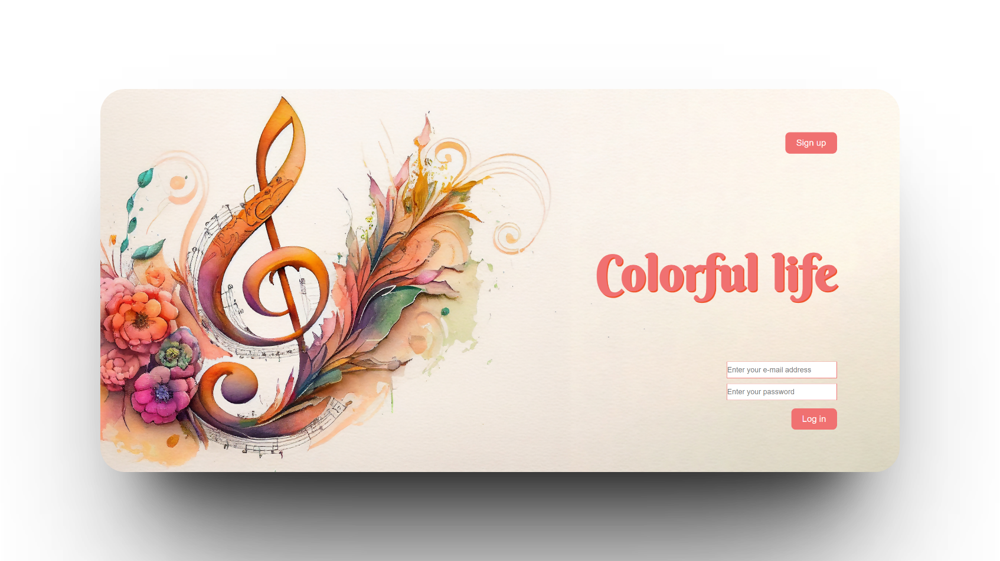
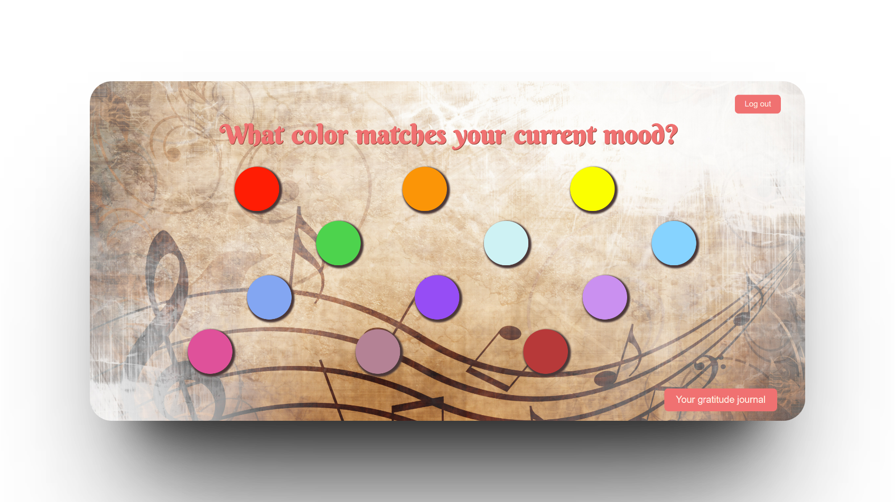
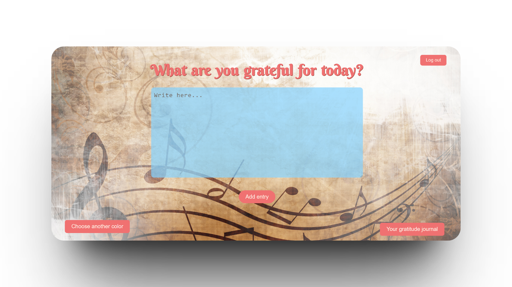
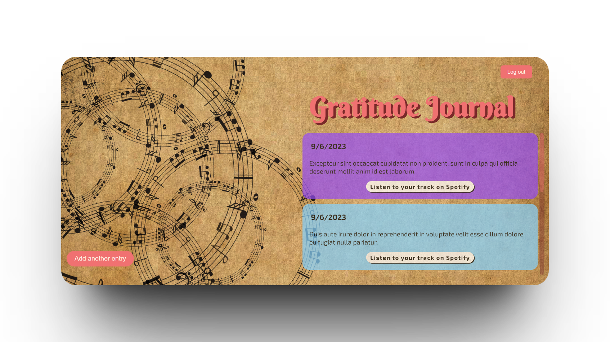

# Colorful Life

Colorful life is a journal that helps you appriciate every day in your life. You can use this application to write down your memories that made your day colorful.

## See Colorful Life In Action

### Use Your Account

Create an account or use exisiting one to log in.


React components for this part are stored in
[here](src/components/SignIn.jsx) and [here](src/components/SignUp.jsx).
<br/>
<br/>

### Choose Color

Choose color that matches your current mood. Be creative and truly ask yourself about your feelings.



React components for this part are stored in
[here](src/components/Grid.jsx) and [here](src/components/Main.jsx).
<br/>
<br/>

### Add Your Entry into Journal

Add entry what are your grateful for today. Remember that this entry is private and only you can see it, so you can write your own truth and be absolutely honest with yourself. Don't be afraid to open up to your thoughts and feelings and be as specific as possible because specificity is key to fostering gratitude.



React components for this part are stored in
[here](src/components/Journal_Form.jsx) and [here](src/components/Main.jsx).
<br/>
<br/>

### Listen Music

Colorful life will match proper track based on the color you chose before. It is based on Skriabin theory of synestesia so there is no randomness. Pay attention to music while you appreciate your day.

React components for this part are stored in
[here](src/components/Journal_Form.jsx) and [here](src/components/Journal_Entries.jsx).
<br/>
<br/>

### View Past Entries

You can always track back your memories by going to archive of your thoughts.



React component for this part is stored in [here](src/components/Journal_Entries.jsx).
<br/>
<br/>

## Technology Stack

- HTML
- CSS
- Sass
- JavaScript
- React
- React.js with Hooks
- Vite.js
- Supabase
- Node.js
  <br/>
  <br/>

## Run Project On Local Environment

If you want to use this project on your local environment you have to go throught the following steps:

1. Clone repository

2. Install node.js v18.12.1

3. Make sure your npm version is 9.3.1
   8.19.2

4. In root directory run following commands:

```
npm install
```

Configuration ensures that Colorful life website will be automatically open in chrome browser after running below command:

```
npm run dev
```

An application will be served on localhost on port 5173.
